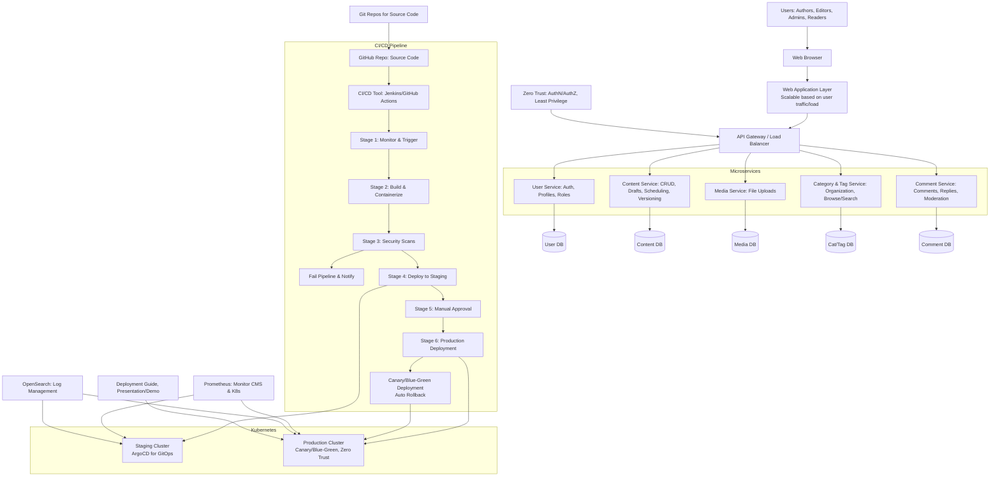
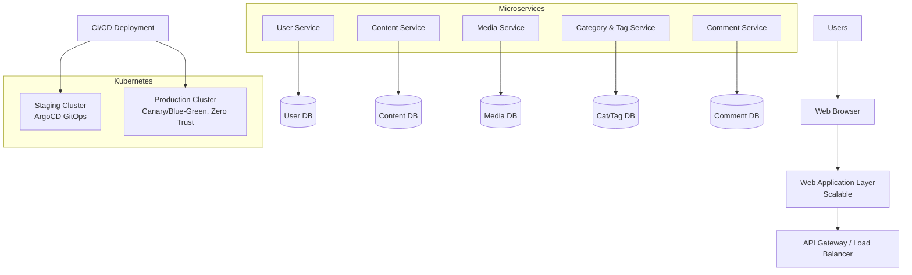

# blog-cms-platform

```mermaid
graph TD
    %% Clients
    User[Users: Authors, Editors, Admins, Readers] --> Browser[Web Browser]
    Browser --> WebApp[Web Application Layer<br>Scalable based on user traffic/load]

    %% API Gateway
    WebApp --> APIGateway[API Gateway / Load Balancer]

    %% Microservices
    subgraph Microservices
        UserSvc[User Service: Auth, Profiles, Roles]
        ContentSvc[Content Service: CRUD, Drafts, Scheduling, Versioning]
        MediaSvc[Media Service: File Uploads]
        CatTagSvc[Category & Tag Service: Organization, Browse/Search]
        CommentSvc[Comment Service: Comments, Replies, Moderation]
    end

    %% Databases
    UserSvc --> UDB[(User DB)]
    ContentSvc --> CDB[(Content DB)]
    MediaSvc --> MDB[(Media DB)]
    CatTagSvc --> CTDB[(Cat/Tag DB)]
    CommentSvc --> CMDB[(Comment DB)]

    %% Connections
    APIGateway --> UserSvc
    APIGateway --> ContentSvc
    APIGateway --> MediaSvc
    APIGateway --> CatTagSvc
    APIGateway --> CommentSvc

    %% CI/CD Pipeline
    subgraph CI/CD Pipeline
        GitRepo[GitHub Repo: Source Code]
        CICD[CI/CD Tool: Jenkins/GitHub Actions]
        Stage1[Stage 1: Monitor & Trigger]
        Stage2[Stage 2: Build & Containerize]
        Stage3[Stage 3: Security Scans]
        Fail[Fail Pipeline & Notify]
        Stage4[Stage 4: Deploy to Staging]
        Stage5[Stage 5: Manual Approval]
        Stage6[Stage 6: Production Deployment]
        DeploymentNote[Canary/Blue-Green Deployment<br>Auto Rollback]

        GitRepo --> CICD --> Stage1 --> Stage2 --> Stage3
        Stage3 --> Fail
        Stage3 --> Stage4
        Stage4 --> Stage5 --> Stage6 --> DeploymentNote
    end

    %% Kubernetes Infrastructure
    subgraph Kubernetes
        Staging[Staging Cluster<br>ArgoCD for GitOps]
        Production[Production Cluster<br>Canary/Blue-Green, Zero Trust]
    end
    Stage4 --> Staging
    Stage6 --> Production
    DeploymentNote --> Production

    %% Monitoring & Logging
    Prometheus[Prometheus: Monitor CMS & K8s] 
    OpenSearch[OpenSearch: Log Management]
    Prometheus --> Staging
    Prometheus --> Production
    OpenSearch --> Staging
    OpenSearch --> Production

    %% Notes
    Note1[Zero Trust: AuthN/AuthZ, Least Privilege] --> APIGateway
    Note2[Git Repos for Source Code] --> GitRepo
    Note3[Deployment Guide, Presentation/Demo] --> Production


```

## Deployment Games

```mermaid

graph TD
    %% Clients
    User[Users] --> Browser[Web Browser]
    Browser --> WebApp[Web Application Layer<br>Scalable]

    %% API Gateway
    WebApp --> APIGateway[API Gateway / Load Balancer]

    %% Microservices
    subgraph Microservices
        UserSvc[User Service]
        ContentSvc[Content Service]
        MediaSvc[Media Service]
        CatTagSvc[Category & Tag Service]
        CommentSvc[Comment Service]
    end

    %% Databases
    UserSvc --> UDB[(User DB)]
    ContentSvc --> CDB[(Content DB)]
    MediaSvc --> MDB[(Media DB)]
    CatTagSvc --> CTDB[(Cat/Tag DB)]
    CommentSvc --> CMDB[(Comment DB)]

    %% Kubernetes
    subgraph Kubernetes
        Staging[Staging Cluster<br>ArgoCD GitOps]
        Production[Production Cluster<br>Canary/Blue-Green, Zero Trust]
    end

    StageDeploy[CI/CD Deployment] --> Staging
    StageDeploy --> Production


```
