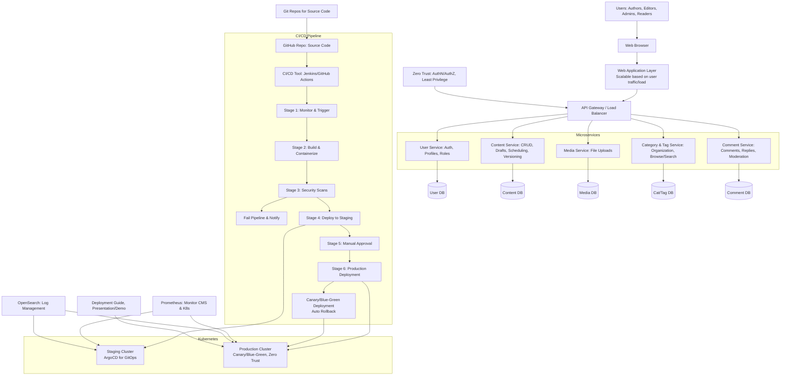
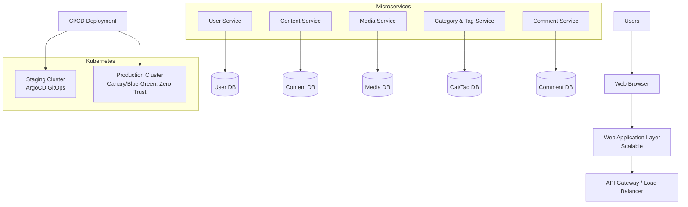
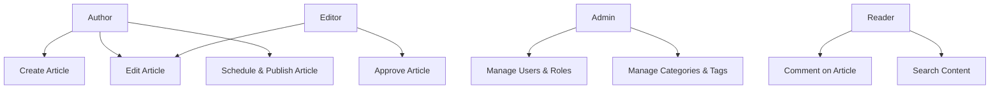
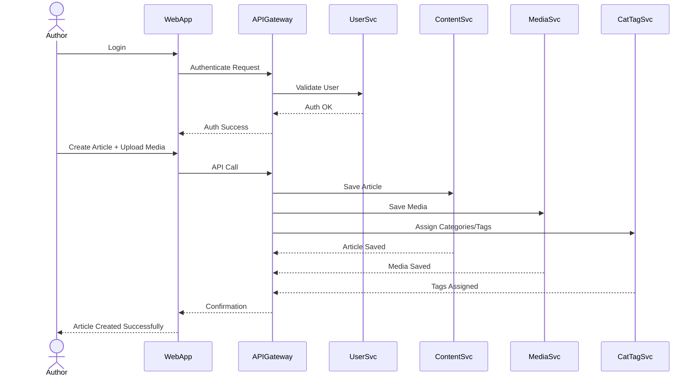
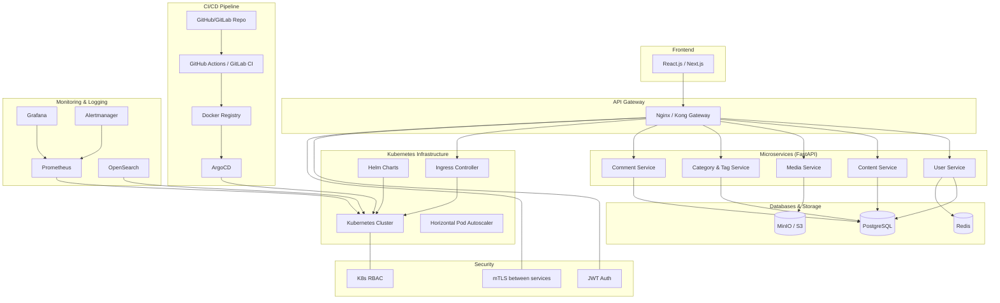

# blog-cms-platform

```mermaid
graph TD
    %% Clients
    User[Users: Authors, Editors, Admins, Readers] --> Browser[Web Browser]
    Browser --> WebApp[Web Application Layer<br>Scalable based on user traffic/load]

    %% API Gateway
    WebApp --> APIGateway[API Gateway / Load Balancer]

    %% Microservices
    subgraph Microservices
        UserSvc[User Service: Auth, Profiles, Roles]
        ContentSvc[Content Service: CRUD, Drafts, Scheduling, Versioning]
        MediaSvc[Media Service: File Uploads]
        CatTagSvc[Category & Tag Service: Organization, Browse/Search]
        CommentSvc[Comment Service: Comments, Replies, Moderation]
    end

    %% Databases
    UserSvc --> UDB[(User DB)]
    ContentSvc --> CDB[(Content DB)]
    MediaSvc --> MDB[(Media DB)]
    CatTagSvc --> CTDB[(Cat/Tag DB)]
    CommentSvc --> CMDB[(Comment DB)]

    %% Connections
    APIGateway --> UserSvc
    APIGateway --> ContentSvc
    APIGateway --> MediaSvc
    APIGateway --> CatTagSvc
    APIGateway --> CommentSvc

    %% CI/CD Pipeline
    subgraph CI/CD Pipeline
        GitRepo[GitHub Repo: Source Code]
        CICD[CI/CD Tool: Jenkins/GitHub Actions]
        Stage1[Stage 1: Monitor & Trigger]
        Stage2[Stage 2: Build & Containerize]
        Stage3[Stage 3: Security Scans]
        Fail[Fail Pipeline & Notify]
        Stage4[Stage 4: Deploy to Staging]
        Stage5[Stage 5: Manual Approval]
        Stage6[Stage 6: Production Deployment]
        DeploymentNote[Canary/Blue-Green Deployment<br>Auto Rollback]

        GitRepo --> CICD --> Stage1 --> Stage2 --> Stage3
        Stage3 --> Fail
        Stage3 --> Stage4
        Stage4 --> Stage5 --> Stage6 --> DeploymentNote
    end

    %% Kubernetes Infrastructure
    subgraph Kubernetes
        Staging[Staging Cluster<br>ArgoCD for GitOps]
        Production[Production Cluster<br>Canary/Blue-Green, Zero Trust]
    end
    Stage4 --> Staging
    Stage6 --> Production
    DeploymentNote --> Production

    %% Monitoring & Logging
    Prometheus[Prometheus: Monitor CMS & K8s] 
    OpenSearch[OpenSearch: Log Management]
    Prometheus --> Staging
    Prometheus --> Production
    OpenSearch --> Staging
    OpenSearch --> Production

    %% Notes
    Note1[Zero Trust: AuthN/AuthZ, Least Privilege] --> APIGateway
    Note2[Git Repos for Source Code] --> GitRepo
    Note3[Deployment Guide, Presentation/Demo] --> Production


```

## Deployment Diagram

```mermaid

graph TD
    %% Clients
    User[Users] --> Browser[Web Browser]
    Browser --> WebApp[Web Application Layer<br>Scalable]

    %% API Gateway
    WebApp --> APIGateway[API Gateway / Load Balancer]

    %% Microservices
    subgraph Microservices
        UserSvc[User Service]
        ContentSvc[Content Service]
        MediaSvc[Media Service]
        CatTagSvc[Category & Tag Service]
        CommentSvc[Comment Service]
    end

    %% Databases
    UserSvc --> UDB[(User DB)]
    ContentSvc --> CDB[(Content DB)]
    MediaSvc --> MDB[(Media DB)]
    CatTagSvc --> CTDB[(Cat/Tag DB)]
    CommentSvc --> CMDB[(Comment DB)]

    %% Kubernetes
    subgraph Kubernetes
        Staging[Staging Cluster<br>ArgoCD GitOps]
        Production[Production Cluster<br>Canary/Blue-Green, Zero Trust]
    end

    StageDeploy[CI/CD Deployment] --> Staging
    StageDeploy --> Production


```

## Use Case Diagram

```mermaid

%% CMS Use Case Diagram
graph TD
    %% Actors
    Author[Author]
    Editor[Editor]
    Admin[Admin]
    Reader[Reader]

    %% Use Cases
    CreateArticle[Create Article]
    EditArticle[Edit Article]
    SchedulePublish[Schedule & Publish Article]
    ApproveArticle[Approve Article]
    ManageUsers[Manage Users & Roles]
    CommentArticle[Comment on Article]
    SearchContent[Search Content]
    ManageCategories[Manage Categories & Tags]

    %% Relationships
    Author --> CreateArticle
    Author --> EditArticle
    Author --> SchedulePublish

    Editor --> ApproveArticle
    Editor --> EditArticle

    Admin --> ManageUsers
    Admin --> ManageCategories

    Reader --> CommentArticle
    Reader --> SearchContent


```

## Sequence Diagram

```mermaid
sequenceDiagram
    actor Author
    participant WebApp
    participant APIGateway
    participant UserSvc
    participant ContentSvc
    participant MediaSvc
    participant CatTagSvc

    Author->>WebApp: Login
    WebApp->>APIGateway: Authenticate Request
    APIGateway->>UserSvc: Validate User
    UserSvc-->>APIGateway: Auth OK
    APIGateway-->>WebApp: Auth Success

    Author->>WebApp: Create Article + Upload Media
    WebApp->>APIGateway: API Call
    APIGateway->>ContentSvc: Save Article
    APIGateway->>MediaSvc: Save Media
    APIGateway->>CatTagSvc: Assign Categories/Tags

    ContentSvc-->>APIGateway: Article Saved
    MediaSvc-->>APIGateway: Media Saved
    CatTagSvc-->>APIGateway: Tags Assigned
    APIGateway-->>WebApp: Confirmation
    WebApp-->>Author: Article Created Successfully

```

```mermaid
flowchart TB
    subgraph Frontend
        FE[React.js / Next.js]
    end

    subgraph "API Gateway"
        GW[Nginx / Kong Gateway]
    end

    subgraph "Microservices (FastAPI)"
        US[User Service]
        CS[Content Service]
        MS[Media Service]
        CTS[Category & Tag Service]
        COMS[Comment Service]
    end

    subgraph "Databases & Storage"
        DB[(PostgreSQL)]
        Storage[(MinIO / S3)]
        Cache[(Redis)]
    end

    subgraph "CI/CD Pipeline"
        Repo[GitHub/GitLab Repo]
        CI[GitHub Actions / GitLab CI]
        Registry[Docker Registry]
        Argo[ArgoCD]
    end

    subgraph "Kubernetes Infrastructure"
        K8S[Kubernetes Cluster]
        Helm[Helm Charts]
        Ingress[Ingress Controller]
        HPA[Horizontal Pod Autoscaler]
    end

    subgraph "Monitoring & Logging"
        Prom[Prometheus]
        Grafana[Grafana]
        OpenSearch[OpenSearch]
        Alert[Alertmanager]
    end

    subgraph Security
        mTLS[mTLS between services]
        RBAC[K8s RBAC]
        JWT[JWT Auth]
    end

    %% Connections
    FE --> GW
    GW --> US
    GW --> CS
    GW --> MS
    GW --> CTS
    GW --> COMS

    US --> DB
    CS --> DB
    CTS --> DB
    COMS --> DB
    MS --> Storage
    US --> Cache

    Repo --> CI
    CI --> Registry
    Registry --> Argo
    Argo --> K8S
    Helm --> K8S
    Ingress --> K8S
    GW --> Ingress

    Prom --> K8S
    Grafana --> Prom
    OpenSearch --> K8S
    Alert --> Prom

    GW --- JWT
    K8S --- RBAC
    GW --- mTLS


```
